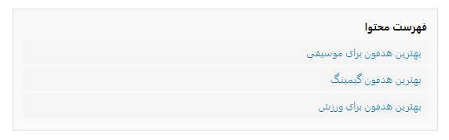

## پلاگین وردپرس برای نمایش فهرست محتوا براساس عناوین h2 مقالات

<p align="center">
  
</p>

## توضیحات
این پلاگین به شما امکان می‌دهد با استفاده از شورت‌کد `[article_toc]`، فهرست محتوا (Table of Contents) را به صورت خودکار و براساس عناوین h2 هر مقاله نمایش دهید. هر عنوان به بخش مربوط لینک می‌شود و ظاهر فهرست قابل سفارشی‌سازی است.

## ویژگی‌ها
- استخراج خودکار عناوین h2 هر مقاله
- نمایش فهرست محتوا با استایل دلخواه
- لینک‌دهی به هر بخش مقاله
- قابل استفاده با شورت‌کد

## نحوه استفاده

1. پلاگین را در مسیر `wp-content/plugins` آپلود و فعال کنید.
2. شورت‌کد زیر را در محتوای مقاله قرار دهید:
   ```
   [article_toc]
   ```

## سفارشی‌سازی استایل
فایل CSS پلاگین در مسیر `assets/css/article-toc.css` قرار دارد و قابل ویرایش است.

---

# Article TOC (English)

WordPress plugin for displaying a table of contents based on h2 headings in articles.

## Features
- Automatically extracts h2 headings from posts
- Displays a customizable table of contents
- Each item links to its section in the article
- Easy to use via shortcode

## Usage

1. Upload and activate the plugin in `wp-content/plugins`.
2. Add the shortcode to your post content:
   ```
   [article_toc]
   ```

## Custom CSS
Edit the plugin’s CSS file at `assets/css/article-toc.css` for styling.

---

**Author:** Zahra Norouzi
**Version:** 1.0
